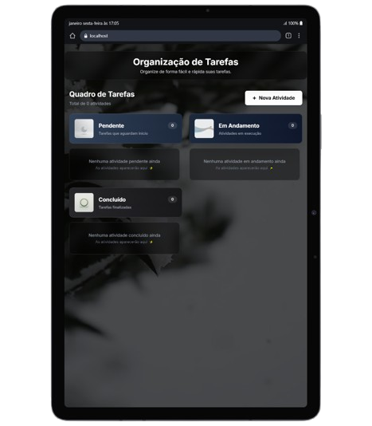
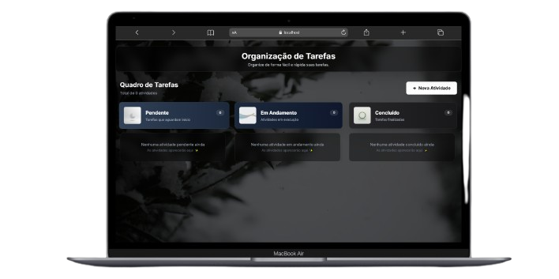

# 🚀 Organizador de Tarefas

Sistema moderno e elegante para gestão de atividades (Kanban), com backend em Python e frontend em React.

## 🛠️ Como Rodar o Projeto

### 1. Backend (Python)
Para facilitar, use os scripts incluídos na raiz do projeto:

**Primeira vez (Configuração):**
Execute o arquivo **`setup_backend.bat`**.
Isso criará o ambiente virtual e instalará todas as dependências automaticamente.

**Para rodar o servidor:**
Execute o arquivo **`run_backend.bat`**.
A API iniciará em: `http://127.0.0.1:8000`

### 2. Frontend (React)
Abra um terminal na pasta `frontend`:
```bash
# Instalar dependências
npm install

# Iniciar o app
npm run dev
```
O app estará disponível no seu navegador (geralmente em `http://localhost:5173`).

OBS:De forma resumida, para iniciar o projeto, use:

git clone https://github.com/yamotoz/Organizador-de-tarefas-em-React-FastAPI.git
clica duas vezes em setup_backend.bat
clica duas vezes em run_backend.bat
abre o terminal na pasta frontend dentro do projeto
digita npm install
digita npm run dev
e pronto, só criar suas tarefas e ser feliz.

---

## 📋 Funcionalidades Principais
- ✅ **Gestão Visual**: Quadro Kanban organizado por status.
- 📸 **Imagens**: Upload de fotos para detalhar cada tarefa.
- ✏️ **Edição**: Altere títulos, descrições e status em tempo real.
- 📱 **Responsivo**: Interface que se adapta a diferentes telas.

## 📱 Screenshots
<div align="center">
  <h3>Versão Mobile</h3>
  
  
  <h3>Versão Tablet</h3>
  

  <h3>Versão Desktop</h3>
  
</div>

## 📁 Organização do Código
- **`/backend`**: API FastAPI com persistência em JSON (`activities.json`).
- **`/frontend`**: Interface React com Tailwind CSS e UI minimalista.
- **`/frontend/public`**: Ícones, vídeos de fundo e assets visuais.


---
Desenvolvido com foco em estética e usabilidade. ✨
